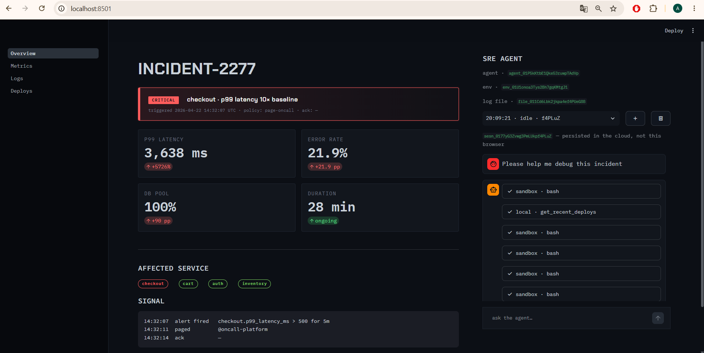
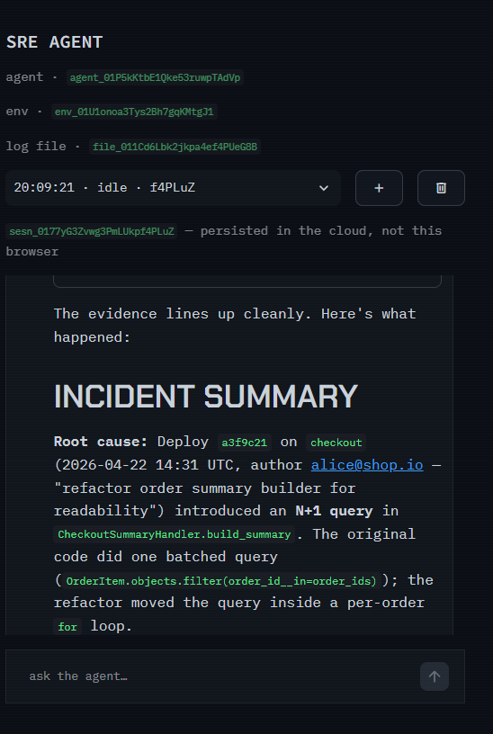

# Claude Managed Agent — Incident Investigator

Implementation completed during the Anthropic workshop:

**How to ship and scale agents with Claude Managed Agents**

- Date: July 16, 2026
- Format: Hands-on online workshop
- Featuring:
  - Isabella He — Applied AI at Anthropic
  - Eric Liu — Product Manager at Notion

## About the project

This project demonstrates how to build an incident-investigation agent using Anthropic Managed Agents.

The application simulates a production incident affecting the `checkout` service of an e-commerce platform. The agent investigates the incident using application logs, service metrics, recent deployments, and source-code diffs.

## Incident scenario

The simulated incident includes:

- P99 latency: 3,638 ms
- Error rate: 21.9%
- Database pool usage: 100%
- Affected service: `checkout`

The goal of the agent is to identify the root cause and recommend an appropriate mitigation.

## Architecture

The application uses the three core Managed Agents resources:

1. **Agent**  
   Defines the Claude model, system instructions, and available tools.

2. **Environment**  
   Provides the cloud execution environment used by the agent.

3. **Session**  
   Connects the agent, environment, uploaded logs, conversation, and tool calls.

The application flow is:

```text
Streamlit UI
    ↓
Managed Agent session
    ↓
Claude analyzes the incident
    ↓
Custom tool calls
    ├── get_metrics
    ├── get_recent_deploys
    └── get_diff
    ↓
Tool results returned to Claude
    ↓
Root-cause analysis and recommendations
```

## Investigation result

The agent identified that deployment `a3f9c21` introduced an N+1 database-query issue in the `checkout` service.

The change moved a database query inside a loop, which caused:

- database connection-pool saturation;
- a major increase in checkout latency;
- a higher error rate;
- failures across several checkout endpoints.

The recommended mitigation was to roll back the deployment and restore the batched query.

## What I implemented

During the workshop, I completed the Managed Agents integration in `agent.py`:

- agent creation;
- cloud environment creation;
- log-file upload;
- session creation;
- event streaming;
- custom tool handling;
- session cleanup.

This helped me understand how an agent uses external tools and evidence to investigate a technical incident.

## Screenshots

### Incident overview



### Investigation result



## Run locally

```bash
python -m venv .venv
source .venv/Scripts/activate
python -m pip install -r requirements.txt
cp .env.example .env
python -m streamlit run app.py

```